# 🌉 Chainlink Treasury & Cross-Chain Bridge POC


## 📋 Overview

This project is a Proof of Concept (POC) for a **Cross-Chain Treasury Management System**. It demonstrates how a Treasury (like Chainlink's) can efficiently manage liquidity across Ethereum and Solana using a hybrid bridging architecture.

The system is designed to handle:
1.  **Strategic Assets ($LINK):** Using a classical **Lock & Mint** mechanism.
2.  **Stablecoins ($USDC):** Using a simulation of **Circle CCTP (Burn & Mint)** for capital efficiency.
3.  **Operational Costs (Gas):** Automated portfolio rebalancing to ensure the Treasury never runs out of SOL for transaction fees.

## 🏗 Architecture

The system consists of three main components:
1.  **Solana Program (Rust):** The on-chain "Vault" and Minting logic.
2.  **Relayer/Bot (Node.js):** The off-chain brain that monitors events and manages keys.
3.  **Frontend/Tests (TypeScript):** Simulation of user interactions and treasury dashboards.

```mermaid
graph TD
    User((👤 User/Treasury))
    
    subgraph "Off-Chain Infrastructure"
        Relayer[🤖 Treasury Bot / Relayer]
    end

    subgraph "Solana Network"
        Program[⚙️ Bridge Contract]
        State[QK Config State]
        wLINK(🪙 wLINK Mint)
        USDC(💵 USDC Mint)
    end

    User -- "1. Lock/Burn on Eth" --> Relayer
    Relayer -- "2. Auto-Refill Gas" --> Program
    Relayer -- "3. Mint Instructions" --> Program
    
    Program <--> State
    Program -- "Lock & Mint" --> wLINK
    Program -- "CCTP Simulation" --> USDC
```



## 📂 Project Structure

- **`/programs/solana_bridge`**: The core Smart Contract logic written in Rust using the Anchor Framework.
  - [📄 **Read Internal Contract Documentation**](./programs/solana_bridge/README.md) 👈 *(Technical Details & Modules)*
- **`/tests`**: Integration tests demonstrating the full lifecycle (Setup, Minting, Security Checks).
- **`/relayer`**: A Node.js bot that monitors chain state and executes automated treasury tasks (Gas Refill).

## 🚀 Key Features

### 1. Hybrid Asset Bridging
Different assets require different risk profiles. This POC implements:
* **Wrapped Assets:** Standard IOU model for generic tokens.
* **Native Issuance:** Simulation of Cross-Chain Transfer Protocol (CCTP) for zero-slippage stablecoin transfers.

### 2. Automated Gas Management
The Relayer actively monitors the Solana Treasury balance. If SOL drops below a critical threshold (e.g., < 1 SOL), the system triggers an automatic rebalancing event (swapping USDC for SOL) to maintain operational uptime.

## 🛠️ Getting Started

### Prerequisites
- Rust & Cargo
- Solana CLI & Anchor
- Node.js & npm

### Installation & Testing

1. **Install Dependencies**
   ```bash
   npm install
   ```

2. **Build the Smart Contracts**
   ```bash
   anchor build
   ```

3. **Run the Test Suite (Localnet)**
   This spins up a local validator, deploys the programs, and runs the full simulation.
   ```bash
   anchor test
   ```

## 🔒 Security Considerations
* **Access Control:** Minting authority is strictly restricted to the `Admin` key (managed by the Relayer).
* **Mock Verification:** For POC speed, CCTP signatures are simulated. In production, this would integrate with Circle's `MessageTransmitter` program.

---
*Built as a Technical Case Study for Chainlink Labs Treasury Engineering.*